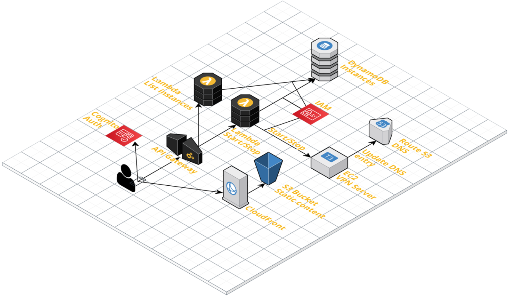

# EC2 Controller

An AWS serverless web app for starting/stopping EC2 instances.

[](https://github.com/kaklakariada/aws-ec2-controller/actions/workflows/build.yml)
[](https://sonarcloud.io/summary/new_code?id=aws-ec2-controller-backend)

## Architecture

EC2 controller uses the following technologies:

* Authentication and Authorization: Cognito
* Static web content: Cloudfront and S3
* Frontend: React and AWS Amplify
* Backend: API-Gateway (REST API) and Lambda
* Storage: DynamoDb
* Deployment: CloudFormation / CDK
* Backend framework: Java 21 and Micronaut with SnapStart



## Deployment to AWS

### Preconitions

To deploy this in your AWS account you will need the following:

* A region where you want to deploy, e.g. `eu-west-1`
* A Route53 hosted zone, e.g. `example.com.` and its ID `XXXXXXXXXXXXXX`
* A subdomain of `example.com` you want to use for the web app, e.g. `ec2-controller.example.com`
* An ACM certificate for `ec2-controller.example.com` or `*.example.com` in `us-east-1` and its ARN `arn:aws:acm:us-east-1:000000000000:certificate/xxxxxxxx-xxxx-xxxx-xxxx-xxxxxxxxxxxx`

On your local machine you will need the following:

* [Node.js](https://nodejs.org/en/) 22
* Java Development Kit (JDK) 21 (e.g. from [Adoptium](https://adoptium.net/?variant=openjdk21&jvmVariant=hotspot))
* [AWS Command line interface](https://aws.amazon.com/cli/)
  * Configure AWS credentials for the AWS CLI by calling `aws configure`

### Build backend

```sh
cd backend
./gradlew clean build
```

The backend will be deployed later when we deploy the infrastructure.

To update the backend after making changes, first build it `./gradlew build`, then deploy the infrastructure with `npm run cdk deploy`.

### Configure infrastructure

Create file `infrastructure/infrastructure-config.ts` based on the following template and fill in your configuration:

```typescript
import { InfrastructureConfig } from "./lib/infrastructure-config-interface";

export const CONFIG: InfrastructureConfig = {
    region: "eu-west-1",
    domain: "ec2-controller.example.com",
    hostedZoneName: "example.com.",
    hostedZoneId: "XXXXXXXXXXXXXX",
    sslCertificateArn: "arn:aws:acm:us-east-1:000000000000:certificate/xxxxxxxx-xxxx-xxxx-xxxx-xxxxxxxxxxxx",
    stackName: "ec2-controller",
    contactEmailAddress: "admin@example.com"
};
```

### Deploy infrastructure and backend

```sh
cd infrastructure
npm run cdk deploy
```

This command will take up to 30 minutes. At the end it will output information you need for configuring the frontend in the next step.

### Configure frontend

Create file `frontend/src/frontend-config.ts` based on the following template and fill in the values for your deployed stack:

```typescript
import { FrontendConfig } from "./environment";

export const CONFIG: FrontendConfig = {
    region: "eu-west-1",
    apiGatewayEndpointUrl: "https://xxxxxxxxxx.execute-api.eu-west-1.amazonaws.com/prod",
    cognitoIdentityPoolId: "eu-west-1:xxxxxxxx-xxxx-xxxx-xxxx-xxxxxxxxxxxx",
    cognitoUserPoolId: "eu-west-1_xxxxxxxxx",
    cognitoUserPoolWebClientId: "xxxxxxxxxxxxxxxxxxxxxxxxxx"
};
```

Create file `frontend/deploy/deploy-config.js` based on the following template and fill in the values for your deployed stack:

```javascript
exports.CONFIG = {
    staticWebsiteBucket: 'ec2-controller-staticcontentbucketxxxxxxxxxxxxxxxxxxxxxx',
    cloudfrontDistributionId: 'XXXXXXXXXXXXXX'
}
```

### Deploy frontend

```sh
cd frontend
npm run deploy
```

### Configure backend

#### Add EC2 instances to whitelist

Add entries to the DynamoDB table for instances that you want to control:

```json
{
    "id": "i-xxxxxxxxxxxxxxxxx",
    "controlAllowed": true,
    "domain": "instance.example.com",
    "sortOrder": 1
}
```

* `id`: AWS EC2 instance ID.
* `controlAllowed`: Allow starting/stopping this instance.
* `domain`: Domain name for this instance. Used to check if DNS entry is in sync.
* `sortOrder`: Specify order in which to display entries in the web app.

#### Create Cognito users

Go to the AWS Cognito console and create users for your new web app. Don't forget to add them to group `Users`.

## Development

### Backend

#### Run local backend server

Configure environment variables for local server: create file `backend/local-server-env.properties` based on the following template and fill in the values for your deployed stack:

```properties
TABLENAME_DYNAMODBINSTANCE = ec2-controller-instances-Backend
HOSTED_ZONE_ID = XXXXXXXXXXXXXX
```

Then start the local server:

```sh
cd backend
./gradlew runServer
```

#### Check for dependency updates

```sh
./gradlew dependencyUpdates
```

#### Configure eclipse project

```sh
cd backend
./gradlew eclipse
```

### Frontend

Run local frontend during development:

```sh
cd frontend
npm start
```

### Upgrade dependencies in `package.json`

```sh
npx npm-check-updates -u && npm install
```

### Managing configuration in a private branch

This project requires some configuration files with deployment specific information, e.g. domain names that should not be stored in a public git repository. That's why these files are added to `.gitignore`. If you want to still keep your configuration under version control you can do so in a private branch (e.g. `private-main`) that you could push to a private repository only.

When switching from `private-main` to the public `main` branch, git will delete the configuration files. To restore them you can use the following command:

```sh
git show private-main:frontend/deploy/deploy-config.js > frontend/deploy/deploy-config.js \
  && git show private-main:frontend/src/frontend-config.ts > frontend/src/frontend-config.ts \
  && git show private-main:backend/local-server-env.properties > backend/local-server-env.properties \
  && git show private-main:infrastructure/infrastructure-config.ts > infrastructure/infrastructure-config.ts
```

### Troubleshooting

#### Building frontend fails because `./frontend-config` is not found

```.\src\environment.ts
Cannot find file './frontend-config' in '.\src'.
```

Create `frontend/src/frontend-config.ts` as described above.

#### There is no "Run" button for my EC2 instance in the web app

Add an entry for your instance to the DynamoDB table and set `controlAllowed` to `true`.

#### Local server returns `404` when running in Eclipse

Configure project using gradle and refresh project in Eclipse:

```sh
cd backend && ./gradlew eclipse
```

#### Unit test fail with a `NullPointerException` when running in Eclipse

Configure project using gradle and refresh project in Eclipse:

```sh
cd backend && ./gradlew eclipse
```

#### `GET /instances` returns error 403 Forbidden

Make sure your Cognito user has role `Users`.

#### Creating a new account does not work.

Creating an account on the login page fails with message `SignUp is not permitted for this user pool`.

Registering of new users is deactivated for the Cognito user pool. You can change this by setting `allowAdminCreateUserOnly` to `false` in `cognito.ts`.

#### Loading instances sometimes takes up to 10s

The backend uses Java Lambdas which need some time for initialization when inactive for araound 15 minutes (cold start).

Solution: rewrite Lambda code e.g. in TypeScript.
